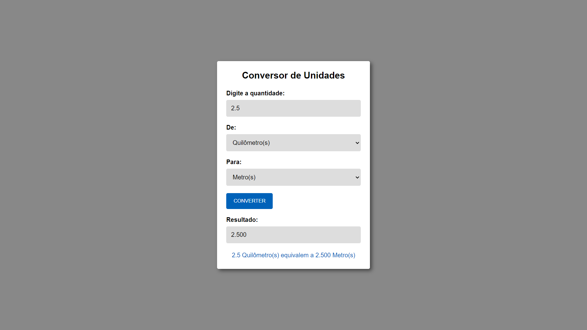

# Conversor de Unidades - v1.0 

  

 

## Resumo

Conversor de Unidades por enquanto só com a unidade de medida de comprimento. 
<a href="https://lucasrochabz.github.io/conversor-de-unidades/" target="_blank">Clique e confira.</a>

## Tecnologias utilizadas:

- HTML
- CSS
- JavaScript

## Como instalar?

- Faça o clone ou download do projeto;
- Abra seu editor de código.
- Certifique-se de ter a extensão "Live Server" instalada.
- No VS Code, abra o arquivo HTML principal do projeto.
- Clique em "Go Live" no canto inferior direito para iniciar o servidor ao vivo.
